<h1 align="center" font-size="200em"><b>Avaliação dos Algoritmos Minimax</b></h1>

## Introdução
<p align="justify">
  Este é um programa desenvolvido em C++ para a disciplina de Algoritmos e Estruturas de Dados I. O mesmo tem por objetivo simular algoritmos Minimax através de processos distintos, verificando o tempo de execução dos três algoritmos e analisando a eficiência destes processos. Seguindo as instruções associadas à aula de análise assintótica, que é responsável por observar a capacidade ou computabilidade dos algoritmos, definindo um "custo" para execução destes. Pois atualmente há uma grande exigência do mercado quanto a diminuição dos custos visando o aprimoramento dos algoritmos. E posteriormente analisando os valores em gráficos.
</p>

## Objetivos
<p align="justify">
  Este programa tem por objetivo verificar o tempo de execução (dado em nanosegundos) dos três algoritmos que implementam a busca de valores mínimos e máximos dentro de um vetor de três maneiras distintas, segundo alguns parâmetros sugeridos dentro de aula.
  O sistema em si deverá identificar qual dos três algoritmos está sendo executado, verificar sua eficiência de execução no mesmo vetor com três ordenações distintas (sendo estas aleatória, crescente e decrescente). Além de repetir este processo por dez vezes e criando uma média do mesmo para retorno do resultado.
  Os tamanhos selecionados para este programa quanto aos vetores foram: 1000, 10.000, 100.000 e 500.000. Sendo um vetor de números inteiros que variam de 0 a 1000.
</p>
<p align="justify">
  Verifica-se abaixo as três arquiteturas de códigos (Em Pascal) que devem ser adaptadas para o programa em C++:
  <p align="center">
  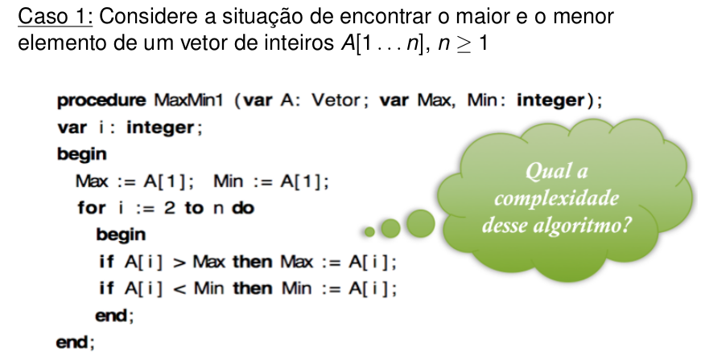
  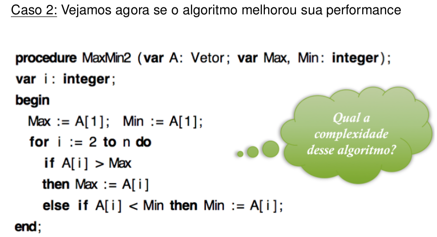
  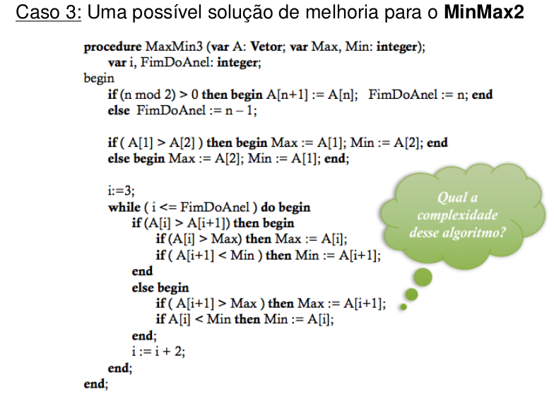
  </p>
</p>

## Arquivos
### dataset
- ```vetores.mps.txt```: arquivo que contém os tempos de execução do programa;
- ```grafico.gp```: arquivo do gnuplot que plota os gráficos;
- ```dados[1...3].txt```: arquivo que contém os tempos de execução do programa em relação aos vetores;
- ```grafico.png```: arquivo que contém o resultado do gnuplot;
## src
- ```MinMax.hpp```: arquivo que contém o cabeçalho das funções MinMax;
- ```MinMax.cpp```: arquivo que contém o código de funcionamento das funções MinMax e auxiliares (manipulação);
- ```main.cpp```: arquivo principal.

## Resolução do problema
<p align="justify">
  Antes de mais nada, quando refere-se a análise assintótica destas funções MinMax, tem-se essa tabela que reune o "gasto computacional" previsto em funções dos algoritmos representados, demonstrando no melhor caso, pior caso e no caso médio.
  <p align="center">
  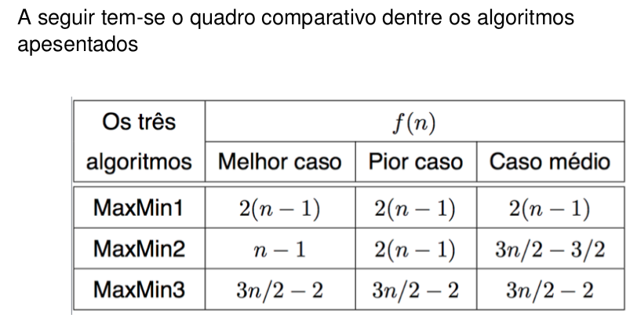
  </p>
Assim sendo tem-se o sistema abaixo contendo os arquivos citados acima além do objetivo de cada função:

- ```vector<int> GerarVetor(int n)```: função responsável por gerar o vetor com o tamanho selecionado e com números aleatórios entre 0 e 1000, retornando o mesmo;
- ```void organizarCrescente(vector<int> vec)```: função responsável por organizar o vetor crescentemente;
- ```void organizarDecrescente(vector<int> vec)```: função responsável por organizar o vetor decrescentemente;
- ```void printarVetor(const vector<int> vec)```: função responsável por imprimir o vetor no terminal;
- ```void registrarVetor(const vector<int> vec, const string nomeArquivo)```: função responsável por escrever no arquivo "vetores.mps" os tempos de execução médio de cada MinMax;
- ```double MinMax1(const vector<int> vec)```: função responsável por verificar o mínimo e máximo do vetor segundo o tipo um estabelecido;
- ```double MinMax2(const vector<int> vec)```: função responsável por verificar o mínimo e máximo do vetor segundo o tipo dois estabelecido;
- ```double MinMax3(const vector<int> vec)```: função responsável por verificar o mínimo e máximo do vetor segundo o tipo três estabelecido;
- ```double Media(const vector<int> vec,int opcao)```: função responsável por fazer a média de dez execuções do MinMax desejado;
<p align="center">
  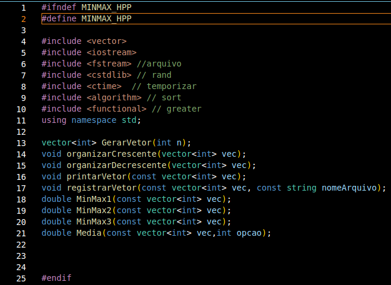
  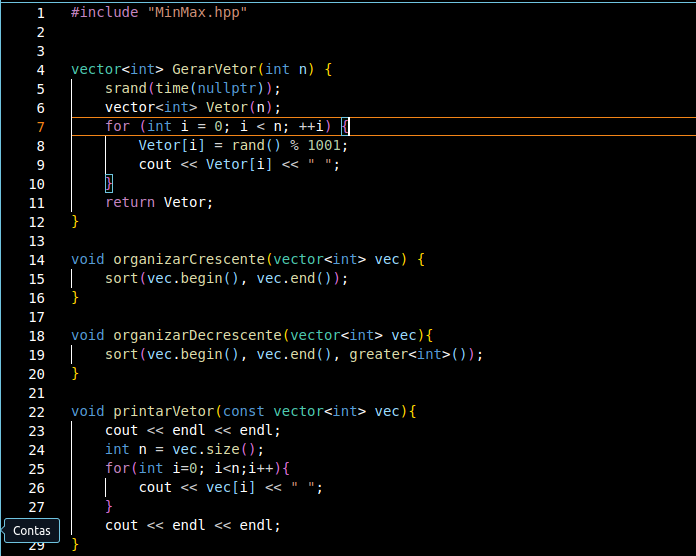
  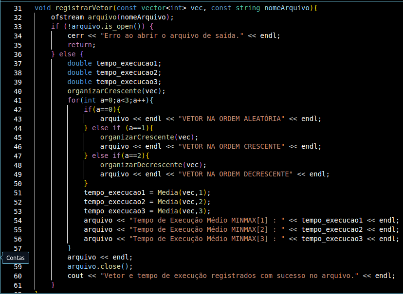
  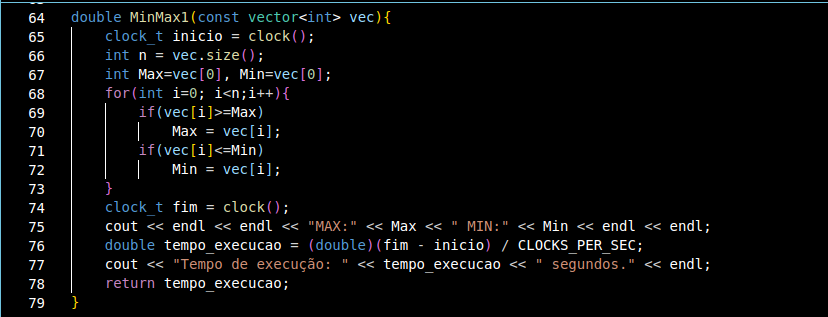
  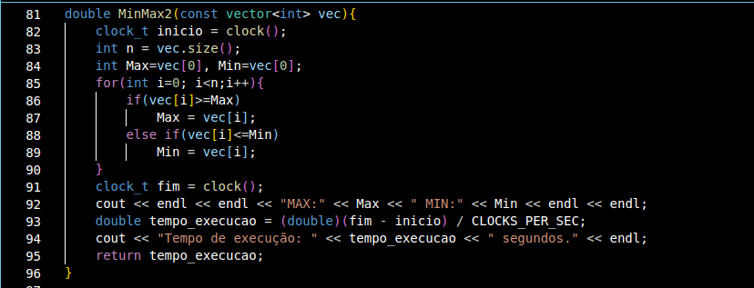
  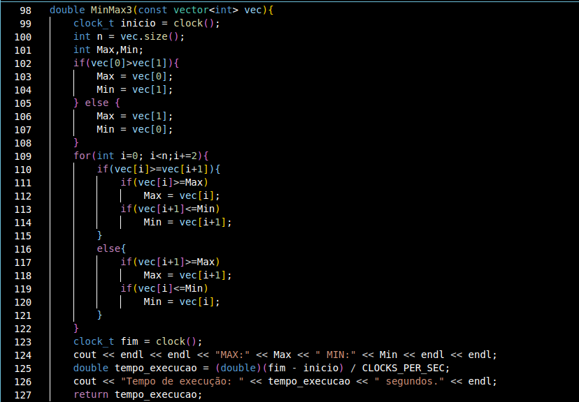
  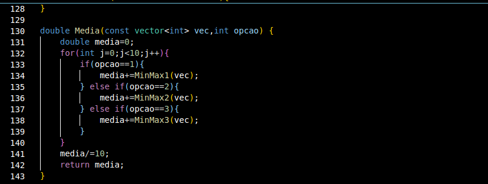
  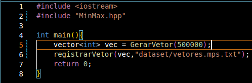
</p>
  Primordialmente utilizei da biblioteca cstdlib devido a função "rand" para gerar os valores aleatórios que serão colocados dentro do vetor através da função "GerarVetor" sendo delimitado entre os inteiros 0 e 1000 através de da linha com "rand() % 1001".
  <br><br>Após isso, criei as funções "organizarCrescente" e "organizarDecrescente" que utilizam da biblioteca algorithm e functional para assim como foi dito na função organizar o vetor crescentemente e decrescentemente, através da função "sort" e "greater".
  <br><br>A biblioteca ctime foi utilizada para quantificar o tempo de execução através da função "clock". A biblioteca fstream foi utilizada para acessar o arquivo com "ofstream",e por fim, a biblioteca vector foi utilizada para facilitar a manipulação de vetores. A função "printarVetor" apenas percorre o vetor printando os valores.
  <br><br>Agora referindo-se ao funcionamento de cada função MinMax, "MinMax1" confere todo o vetor através de um laço "for", utilizando duas operações lógicas "if" e gerando um consumo computacional em forma de função "2(n-1)" sendo "n" o tamanho do vetor.
  <br><br>Por sua vez, "MinMax2" confere todo o vetor através de uma operação lógica "if" e outra "else if" gerando uma otimização do tempo de execução, que varia dentre as funções "(n-1)" no melhor dos casos e "(3n-3/2)" no pior dos casos.
  <br><br>E por fim, "MinMax3" verifica as duas posições iniciais (para já facilitar caso uma delas seja o mínimo ou máximo) e por seguinte utiliza de um laço "for" único para verificar tanto uma posição quanto a sua sucessora, facilitando o algoritmo e tornando todos os casos com consumo computacional de tempoem"(3n-3/2)".
  <br><br>A função "Media" basicamente recebe o vetor e uma opção que refere-se ao qual MinMax o usuário deseja fazer uma média de tempo de execução. No fim somando-os e dividindo por dez, assim retornando essa média. E a função "registrarVetor" abre o arquivo de saida, declara os tempos de execução (chamando a função Media) e no fim imprimindo dentro do arquivo de maneira organizada.
  <br><br>Assim na main apenas geramos o vetor com o tamanho desejado e utilizamos a função "registrarVetor" que engloba o programa todo em sua base.
  <br><br>Agora referindo-se aos casos de testes sugeridos, tem-se a tabela abaixo com a média de execução coletada durante os testes:
  <p align="center">
  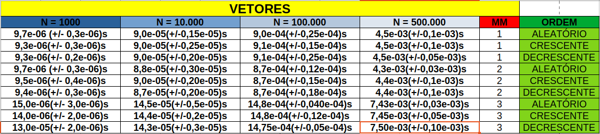
  </p>
<br><br>Como verificamos acima, os valores são dados em nanosegundos, possuindo uma variação coletada durante os testes. Como à exemplo, com o vetor de tamanho 1000 utilizando o "MinMax1" ordenado de modo aleatório demorou cerca de 9,7 * 10⁻⁶ nanosegundos, com uma abertura de mais ou menos 0,3 * 10⁻⁶. Durante a execução, o terminal demonstra o vetor e os valores mínimos e máximos enquanto o arquivo demonstra o tempo, como mostrado abaixo:
  <p align="center">
  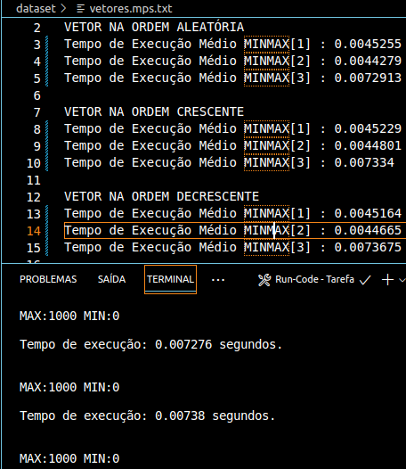
  </p>
Assim sendo, utilizando da linguagem gnuplot para criarmos os gráficos a partir do "pior resultado" de cada um dos casos vistos na tabela, observe o codigo para compilação abaixo e como ele deve ser compilado no terminal (obs: você deve abrir a pasta do arquivo no terminal):
  <p align="center">
  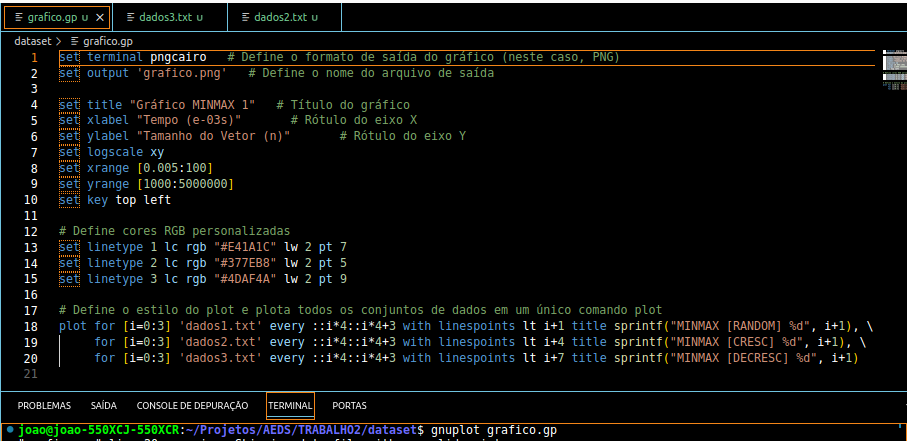
  </p>
Além disso esses são os dados analisados, separados por arquivos que representam como o vetor estava organizado:
  <p align="center">
  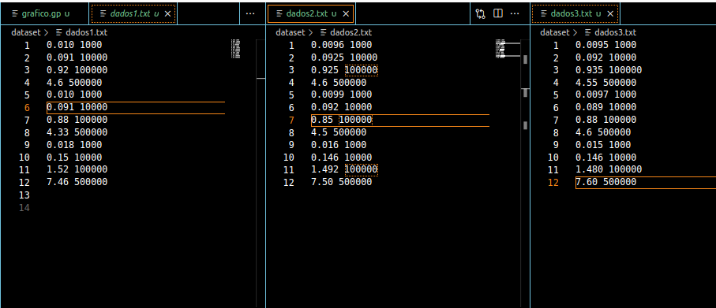
  </p>
Tem-se esses três gráficos do tempo de execução pelo tamanho do vetor, separados pela maneira como o vetor está ordenado:
<table>
    <tr>
       <td>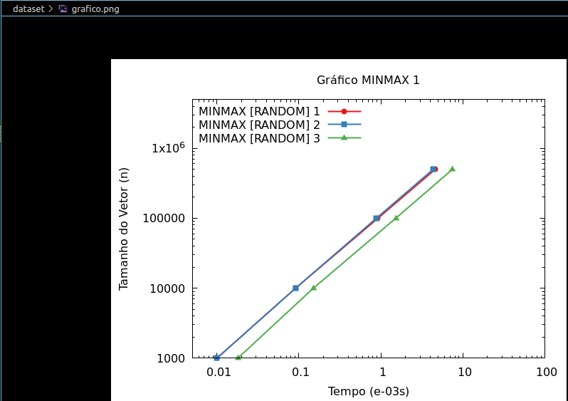</td>
       <td>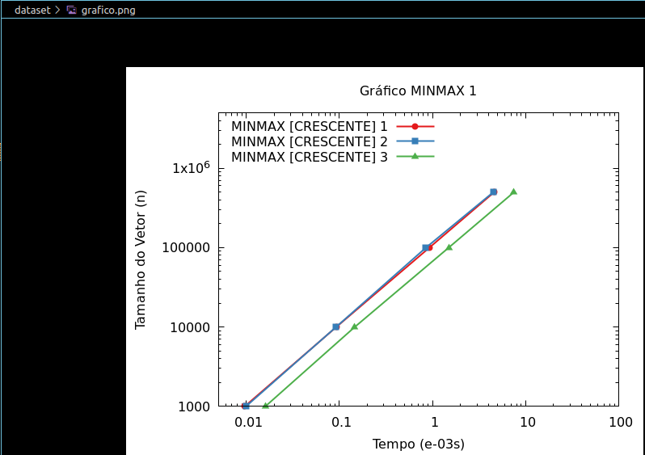</td>
       <td>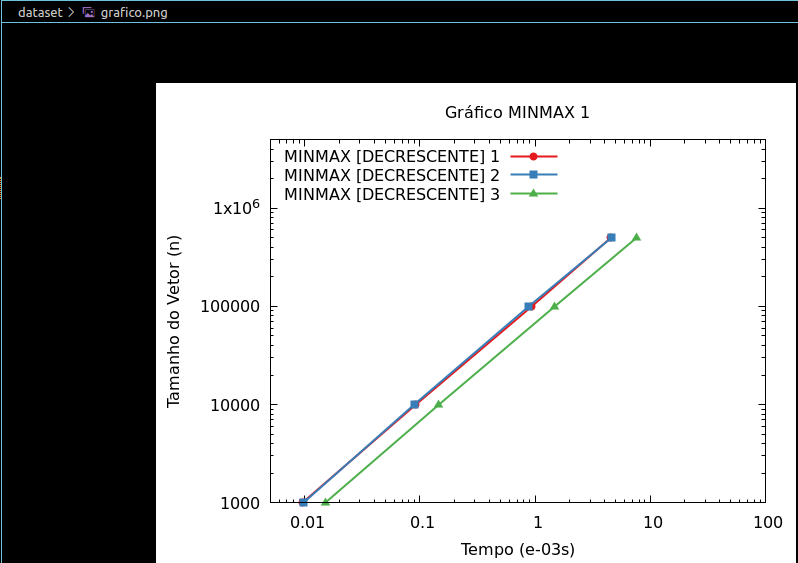</td>
    </tr>
</table>
<br>Nota-se um maior intervalo de execução provindo do "MinMax3" apesar de seu desempenho ser teoricamente o mais "otimizado" relativo a execução das funções. Agora observando os MinManx1 e MinMax2 percebe-se uma curva muito semelhante, muitas vezes quase imperceptível quando se trata de grande valores. Porém ao se aproximar do mesmo, principalmente nos vetores de maior números, tem-se o veredito de que o MinMax2 apresenta a melhor constância de valores e maior otimização quanto a tempo de execução. Isso fica principalmente vísivel quando o vetor esta ordenado crescentemente, demonstrando a real queda de otimização do MinMax1. Observe abaixo a junção de todos os gráficos vistos acima:
  <p align="center">
  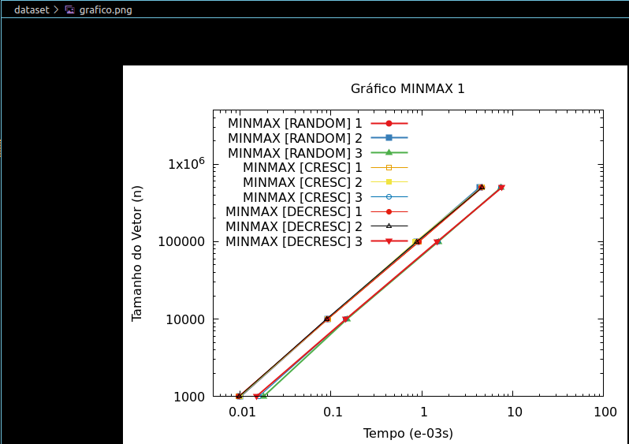
  </p>
</p>


## Conclusão
<p align="justify">
  Tendo em vista todos os dados coletados, percebe-se que apesar do comportamento teoricamente mais eficaz do "MinMax3" ainda sim o tempo de execução do mesmo demonstrou a maior janela de tempo, isso em geral deve-se a vários fatores discutidos em sala, principalmente pela facilidade do sistema em executar programas com lógicas simples, assim sendo há-se essa justificativa quanto a aplicação teórica das funções que representam o consumo computacional e os exemplos aplicados.
  <br><br>Sendo assim, teoricamente apesar do "MinMax3" apresentar o melhor algoritmo de busca dentre os três definidos, ainda sim seu tempo de execução varia em pouco dentros os demais. Paralelamente a isso, as funções "MinMax1" e "MinMax2" apresentam janelas de tempos semelhantes, onde "MinMax1" variava mais durante os testes criando uma resposta menos precisa, enquanto "MinMax2" apresentava uma maior precisão de dados durante o teste.
  <br><br>Além disso, como citado anteriormente, muitos dos fatores externos podem variar esse tempo de execução (podendo até mesmo ultrapassar a margem de erro colocada na tabela), dentre os motivos tem-se: especificações da máquina responsável pela compilação, o próprio compilador, o sistema operacional, a repetição de valores dentro do vetor e outros fatores que afetam diretamente a execução. Pois, se tratando de uma função que o tempo de execução em IDES atuais são ínfimos, a variação se torna ainda mais distoante de acordo com o acúmulo das circustâncias citadas acima. A máquina a qual esse trabalho foi inicialmente processado não é muito potente comparado a parâmetros atuais, gerando possivelmente uma diferença de médias quando executadas em máquinas mais polidas ou até mesmo que possuam sistemas operacionais distintos. Um dos fatores a ser citado é justamente o comportamento das funções MinMax1,2 e 3 se manterem como polinomais e com curvas semelhantes, demonstrando que independente da máquina utilizada para o experimento o comportamento da função permanecerá linear.
  <br><br>Conclui-se que a analise assintótica atrelada a fatores de analíse estatística pode ser crucial para determinar, assim como em laboratórios simples que demadam grande precisão, a importância da consideração de fatores externos a compilação. Compreendendo assim um maior escopo de circustâncias que, quando trata-se de grandes massas de dados ou de um problema numa escala do bilhão, pode acarretar em um déficit na otimização deste tempo de execução.
</p>

## Referências
DA SILVA, Michel Pires. Material de aula: Análise Assintótica. 8 atrás. 2024. Apresentação de slides. Disponível em: <https://ava.cefetmg.br/pluginfile.php/250215/mod_resource/content/8/Aula1.pdf>. Acesso em 18 mar. 2024.


## Compilação e execução
* | Comando                |  Função                                                                                           |                     
  | -----------------------| ------------------------------------------------------------------------------------------------- |
  |  `make clean`          | Apaga a última compilação realizada contida na pasta build                                        |
  |  `make`                | Executa a compilação do programa utilizando o gcc, e o resultado vai para a pasta build           |
  |  `make run`            | Executa o programa da pasta build após a realização da compilação                                 |

## Contato
<div>
<a style="color:black" href="mailto:jprs1308@gmail.com?subject=[GitHub]%20Source%20Dynamic%20Lists">
✉️ <i>jprs1308@gmail.com</i>
</a>
